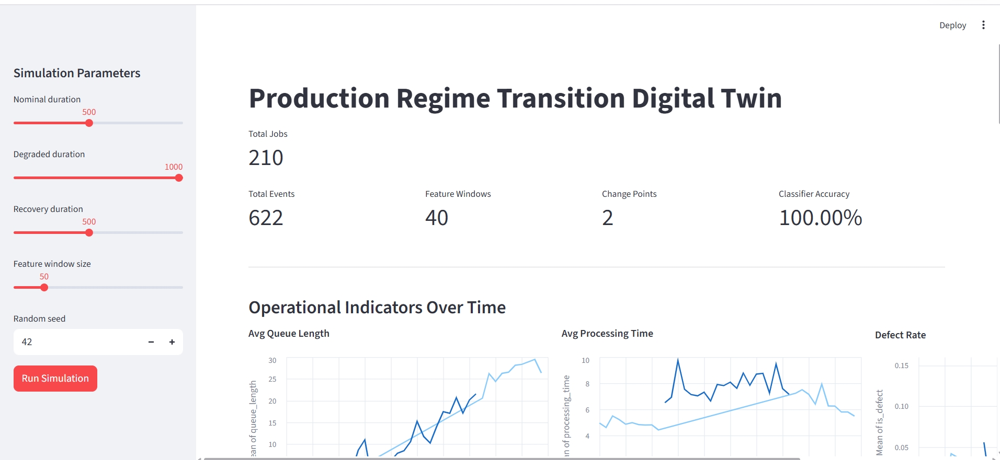
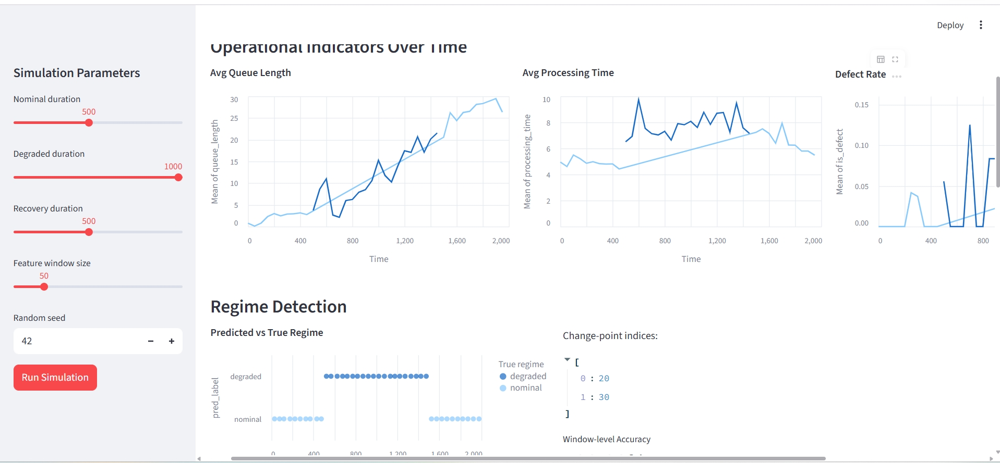
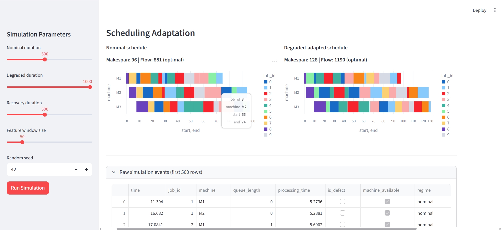
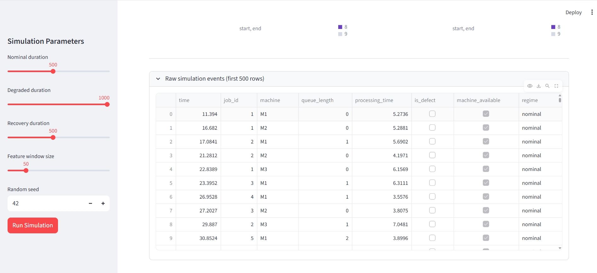

# Production Regime Transition Digital Twin

Prototype inspired by **production planning under uncertainty** — simulating a
production line with nominal and degraded regimes, detecting regime changes
from operational indicators, and adapting the schedule via constraint
programming.

The goal is to connect four ideas: **state representation, regime transition
detection, scheduling under constraints, and decision traceability.**

---

## Why this project

This prototype was built as a small technical exploration around production
planning under uncertainty.

It does **not** aim to solve a full industrial scheduling problem. Its purpose
is to connect, in a minimal and reproducible way, the main building blocks of
the PhD topic: production state representation, regime transition detection,
scheduling under constraints, and decision traceability.

The simplified workflow is:

1. simulate a production line with nominal and degraded regimes;
2. extract operational indicators from event logs;
3. detect regime changes and classify operating states;
4. adapt a job-shop schedule according to the estimated regime;
5. expose the results through a small dashboard.

---

## Dashboard









---

## Stack

| Block                    | Tool                  |
| ------------------------ | --------------------- |
| Simulation               | SimPy                 |
| Regime detection         | ruptures + scikit-learn |
| Scheduling               | OR-Tools CP-SAT       |
| Experiment tracking      | MLflow                |
| Dashboard                | Streamlit + Altair    |

## Key technical choices

- **SimPy** is used to model the production line as a discrete-event system.
- **ruptures** is used to detect change points in operational indicators.
- **scikit-learn** provides a simple baseline classifier for regime recognition.
- **OR-Tools CP-SAT** is used to formulate the scheduling problem under machine constraints.
- **MLflow** is used to track parameters, metrics and generated artifacts.
- **Streamlit** provides a lightweight dashboard to inspect the full pipeline.

## Quick start

```bash
uv sync
uv run python src/simulation.py          # standalone demo
uv run streamlit run src/app.py          # interactive dashboard
```

## Structure

```
src/
  config.py             # Dataclass configuration
  simulation.py         # SimPy production line (3 machines, nominal/degraded)
  features.py           # Window-based operational indicators
  regime_detection.py   # ruptures.Pelt + RandomForestClassifier
  scheduler.py          # OR-Tools CP-SAT job-shop with regime adaptation
  experiments.py        # MLflow experiment tracking
  app.py                # Streamlit dashboard
```

## Limitations and next steps

This is a simplified prototype. The production line is synthetic, the degraded
regime is predefined, and the scheduling adaptation remains basic.

The next steps would be to:

- introduce stochastic demand and machine-specific disruptions;
- compare several detection methods for regime transitions;
- include uncertainty-aware scheduling objectives;
- evaluate the impact of wrong regime detection on planning decisions;
- extend the simulation toward a richer digital twin with feedback loops.
